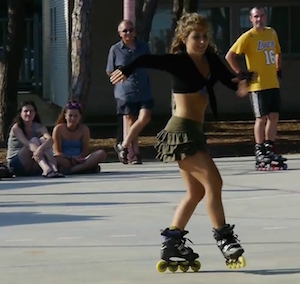

### pose-estimation-deep-learning

[CNTK](https://github.com/Microsoft/CNTK) implementation of [Realtime_Multi-Person_Pose_Estimation](https://github.com/ZheC/Realtime_Multi-Person_Pose_Estimation)

#### Results
Run `demo.py` to see the result if you have cntk and other requirements installed.

